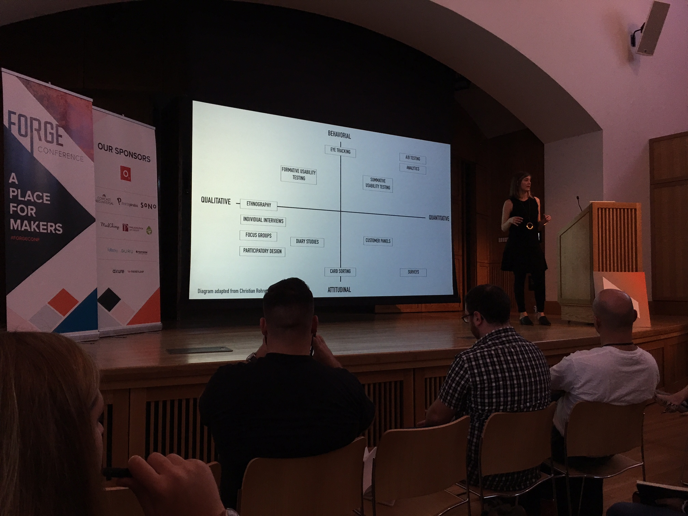

# [Forge Conference 2015](http://forgeconf.com/)
* October 9, 2015

## Keynote - The Age of How
* 9:15am - 10:15am Harrison Auditorium
* [Michael Lebowitz](http://twitter.com/mikelebowitz)
* Design=Everything
* Defining yourself by your tools is dangerous (iPhone killed flash)
* It's about outcomes, not outputs
* Diversity brings in outside thought, adds to the discussion
* Values, take care of each other, collaborate inside and out, speak up (no silent disagreemet). do great work

## Native or Not? the Untapped Power of Web Apps
* 10:20am - 11:20am Widener Lecture Room
* [Dan Tello](http://twitter.com/dantello5)
* Web vs Native is not a techonlgy problem, its a focus problem
* 60fps
* [jankfree.org](jankfree.org)
* Using canvas to get 60fps
* sketch.js
* [JamBells.com](jambells.com)

## Your Data Are Wrong: The Hype and Reality of Big Data
* 11:25am - 12:25pm Widener Lecture Room
* [Judd Antin](http://twitter.com/juddantin)
* When possible embedded research team, not separate
* Know thyself, know your biases
* You are not the user
* Homophily
* Be aware of biases
  * Comfirmation bias
    * look for and interpret findings that support your hypothesis
    * "validate our design decisions" this is just wrong
  * The mere exposure effect
    * The more you see something, the more you will like it
    * Falling in love wih your own designs
  * Minimal Group Paradigm
    * Any group you are associated with, you are preferencial to
* Know your limits
* All methods are weak and strong
* Qualitative methods don't generalize or scale but provide rich feedback
* Surveys often happen too late, after the interaction is over
* Big data is descriptive, not explanatory
* What, how, why
  * Descriptive, explanatory, interpretive
* Not everything counted counts, and not everyting that counts is counted
* Always do multimethod research to help combat bias
* Becareful of over generalization

## Lunch
* 12:30pm - 1:30pm Main Lobby

## Leveraging Community to Build Great Products
* 1:40pm - 2:40pm Widener Lecture Room
* [Nickey Skarstad](http://twitter.com/nickeyskarstad)
* Product and community should intersect, results in better products
* Work with your users to build products
* Invite into the process
* Let them help you build what theyll use
  * Dont be scare of your users!
  * Helps stem change aversion
* Visit your users in their settings, see how they work
* Get users to uses ASAP with their data, real tasks
* "A prototype is worth a thousand meetings"
* Etsy teams (like google groups) for early access to a feature, forum for discussion
* Let them turn off the new version, learn from why/when/how often they turn it off

## Less is More: Social Media and the Artist
* 2:45pm - 3:45pm Widener Lecture Room
* [King Britt](http://twitter.com/kingbritt)

## In Defense of the Floppy Disk: The Vocabulary of the Interface
* 3:50pm - 4:50pm Widener Lecture Room
* [Lis Pardi](http://twitter.com/LisPardi)
* PhillyChi
* Icons dont work with out context
* 

## Keynote - Design Everything
* 4:55pm - 5:55pm Harrison Auditorium
* [Cap Watkins](http://twitter.com/cap)