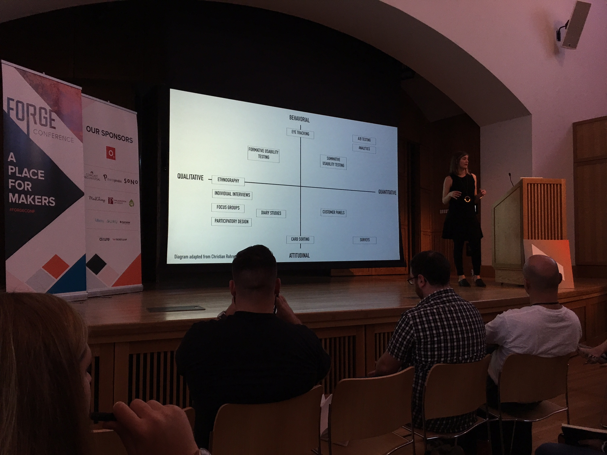

# [Forge Conference 2015](http://forgeconf.com/)
* October 9, 2015

## Keynote - The Age of How
* 9:15am - 10:15am Harrison Auditorium
* [Michael Lebowitz](http://twitter.com/mikelebowitz)
* Design=Everything
* Defining yourself by your tools is dangerous (iPhone killed flash)
* It's about outcomes, not outputs
* Diversity brings in outside thought, adds to the discussion
* Values, take care of each other, collaborate inside and out, speak up (no silent disagreemet). do great work
* Use design skills to design internal processes such as the on-boarding process. Do interviews, etc., just like a UX design
* Burnout is caused by information not flowing smoothly

## Native or Not? the Untapped Power of Web Apps
* 10:20am - 11:20am Widener Lecture Room
* [Dan Tello](http://twitter.com/dantello5)
* [Slides](http://slides.com/dantello/native-or-not-3#/)
* Web vs Native is not a techonlgy problem, its a focus problem
* 60fps
* [jankfree.org](jankfree.org)
* Using canvas to get 60fps
* sketch.js
* [JamBells.com](jambells.com)

## Your Data Are Wrong: The Hype and Reality of Big Data
* 11:25am - 12:25pm Widener Lecture Room
* [Judd Antin](http://twitter.com/juddantin)
* When possible embedded research team, not separate
* Know thyself, know your biases
* 
* You are not the user
* Homophily
* Be aware of biases
  * Comfirmation bias
    * look for and interpret findings that support your hypothesis
    * "validate our design decisions" this is just wrong
    * 
  * The mere exposure effect
    * The more you see something, the more you will like it
    * Falling in love wih your own designs
  * Minimal Group Paradigm
    * Any group you are associated with, you are preferencial to
* Know your limits
* All methods are weak and strong
* Qualitative methods don't generalize or scale but provide rich feedback
* Surveys often happen too late, after the interaction is over
* Big data is descriptive, not explanatory
* What, how, why
  * Descriptive, explanatory, interpretive
* Not everything counted counts, and not everyting that counts is counted
* Always do multimethod research to help combat bias
* Becareful of over generalization
 
## The Homepage is Dead: Designing for Content and Functionality
* 11:25am - 12:25pm Widener Lecture Room
* Natalie Be'er (Huge)
* Regardless of how a user gets to a page, the navigation system should show them where they are
* For this reason, she hates the Hamburger (because it hides navigation)
* Assume every page is an entry page
* The homepage should focus on the features that are used the most and the content that the homepage user wants to see
* Don't take functionality away from the mobile version of websites

## Lunch
* 12:30pm - 1:30pm Main Lobby

## Leveraging Community to Build Great Products
* 1:40pm - 2:40pm Widener Lecture Room
* [Nickey Skarstad](http://twitter.com/nickeyskarstad)
* Product and community should intersect, results in better products
* Work with your users to build products
* Invite into the process
* Let them help you build what they'll use
  * Dont be scared of your users!
  * Helps stem change aversion
* Visit your users in their settings, see how they work
* Get users to uses ASAP with their data, real tasks
* 
* Etsy teams (like google groups) for early access to a feature, forum for discussion
* Let them turn off the new version, learn from why/when/how often they turn it off

## Less is More: Social Media and the Artist
* 2:45pm - 3:45pm Widener Lecture Room
* [King Britt](http://twitter.com/kingbritt)

## In Defense of the Floppy Disk: The Vocabulary of the Interface
* 3:50pm - 4:50pm Widener Lecture Room
* [Lis Pardi](http://twitter.com/LisPardi)
* [Slides](http://www.slideshare.net/lispardi/confab-higher-ed-2014-in-defense-of-the-floppy-disk)
* PhillyChi
* Icons dont work without context
* 
* We use metaphors in speech. We also use metaphors in icons
* The hamburger icon has been around since 1981. Various contemporary studies show that it is not well understood.

## Keynote - Design Everything
* 4:55pm - 5:55pm Harrison Auditorium
* [Cap Watkins](http://twitter.com/cap)
