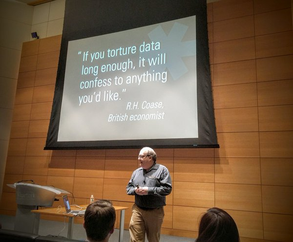

# Is Design Metrically Opposed? 
* January 6, 2016
* [Jared Spool](https://twitter.com/jmspool)
* Presented by [PhillyCHI](http://phillychi.acm.org/)
* [About](https://www.uie.com/jared-live/#design-opposed)
* [Video](https://player.vimeo.com/video/138359368)
* Are we measuring the right thing?
* Oberservations -> Inferences -> Design Decisions
  * What -> Why -> How to improve
* The best designs never stop at the first inference
* Beware of silly/stupid metrics
* 
* Analytics packages can't tell us why something happened
  * bounce rate, conversion rate -> neither tells why a user did something
* Ratios are always a bad metric, both sides of the equation can be manipulated
* Satisfaction surveys -> Satisfaction is too low of a bar, we can do better than simply satisfied
* Customer journey maps
  * watch a customer use your design, see the pains they go through, this leads to big wins
* Useful custom metric is counting error messages. It is useful to know that errors the user is seeing to see if there is anything we can do to prevent those errors from occuring.
* Custom metrics > generalized analytic metrics
* Oberservations trump inferences, turn inferences into observations via testing
* UX needs to own analytics
* Data science is essential for every UX team
* Question what every metric means, what are we learning from collecting it
* Keep metric numbers simple, forces focus
* Design must drive metric collection, not the other way around
* [Gallup CE11](http://www.gallup.com/businessjournal/745/constant-customer.aspx) as a customer engagement survey 
* Conference [UX Immersion: Interations](https://uxi16.uie.com)