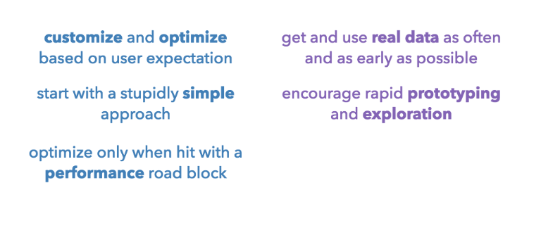
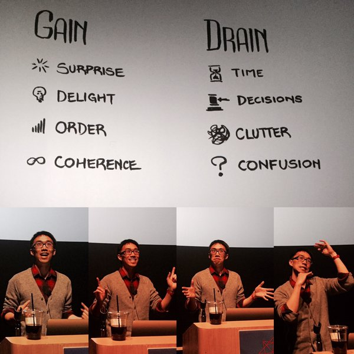
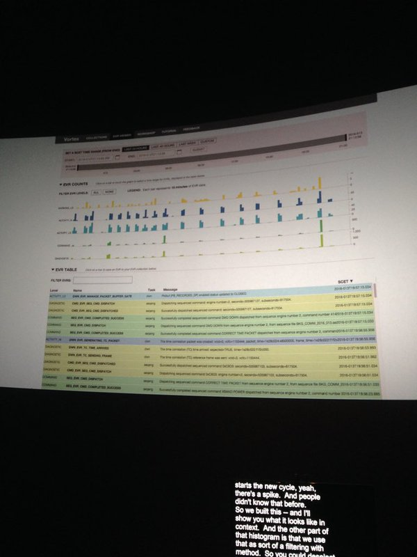

# OpenVis Conference, April 24-26, 2016
* [Site](https://openvisconf.com/)
* Bocoup Youtube for old vids
* [Google Docs Notes](http://bit.ly/ovc-2016-notes)

## Introduction to D3.js (Workshop)
* [Slides & Notes](http://bit.ly/ovc-d3-workshop)
* [K Adam White](http://twitter.com/kadamwhite)
  * [GitHub](http://github.com/kadamwhite)
* [Bob Holt](http://twitter.com/bobholt)
  * [GitHub](http://github.com/bobholt)
* [blocks](http://bl.ocks.org) - Gallery
* [blocks explorer](http://bl.ocksplorer.org/) - Nicer front end
* d3 upgrade process is in progress (v4.0)
* [Learnjsdata.com](http://learnjsdata.com/)
* Selections
   * similiar to jQuery selectors
   * selectors return array of array, important for sizing
   * use .node() to get native HTML DOM node
   * .call(selection) as an iterator over all DOM elements
* Data Binding
  * Data joins, one to one mapping
  * Terminology
    * entering - new data, doesnt exist on page
    * updating - data already on the page
    * exiting - data removed from page
  * .data method for binding array data to selections
    * the function passed in determines uniqueness
* Scales
  * .extent takes in array and returns hi and low
  * can use this in the scale method
  * domain is input, range is output?
* SVG
* Axes
  * d3 can create, but we must position

## Seeing Machines Think
* Fernanda Viégas and Martin Wattenberg
* Neural nets, based on the human brain
* Learn over time
* Red/White wine machine learning
  * only can determine if its be trained
* [TensorFlow.org](http://TensorFlow.org)

## A Return to Machine Learning
* [Kyle McDonald](http://twitter.com/kcimc)

## Drawing on <canvas> - how computers read pixels
* [Mariko Kosaki](http://twitter.com/kosamari)
* [Slides](http://kosamari.com/presentation/openvis-2016/)
* Using canvas, getImage putImage for performing image processing
* Creating fake instagram filters
* Can be slow in browser
  * web workers to push off expensive calcs
* toDataURL v toBlob to export
  * toDataURL is expensive to handle image in Base64, href length is capped
  * toBlob need to specify compression algo
* [grafi.js](http://grafijs.org/) - JS Image processing library

## How To Simulate The Universe, In 134 Easy Steps
* [Nicky Case](http://ncase.me/) - website
* [Twitter](https://twitter.com/ncasenmare)
* [Slides](http://ncase.me/OVC2016/)
* Trends show what, but not why
* Systems thinking, the world is loopy, everything effects everything else
* [Parable of the Polygons](http://ncase.me/polygons/)
* In a loopy world, there is no root cause, only in linear process
* You are not stuck in traffic, you are traffic
* Story telling about systems (tools)
  * Movies/Books/Lit
    * Book building stories
    * Breakfast of Champions
    * A visit from the goon squad
  * Causal loop diagram
  * Stock and Flow Models
    * bathtub, stuff flows in and stuff flows out
    * for simulations things go in and out
  * Probabiltiy Simulations
  * Agent-based modeling
    * Makes decisions based off others decisions
    * Parable of Polygon is agent-based

## Do you know Nothing when you see it?
* [Amelia McNamara](http://twitter.com/AmeliaMN)
* [Slides](http://www.science.smith.edu/~amcnamara/blog/conferences/2016/04/25/OpenVisConf.html)
* Statical based determining if values are significant

## SVG Beyond Mere Shapes
* [Nadieh Bremer](http://twitter.com/NadiehBremer)
* [Website](http://www.visualcinnamon.com/)
* [Slides](http://www.visualcinnamon.com/2016/04/svg-beyond-mere-shapes.html)
* Wanted ot create gradient legend
  * add linearGraient to defs
  * set x1, x2...
  * gradient is the bounding box, not necessarily the shape
  * add stops
  * can use style attr to reference gradient id
  * radialGradients
  * linearChorGradients
* Filters
  * Added to SVG defs
  * Set the filters style
  * using blur so show speed
  * gooey effect
* CSS mix-blend-mode

## Enhancing your maps and visualizations with WebGL GLSL Shaders
* [Patricio Gonzalez Vivo](http://twitter.com/patriciogv)
* [Slides](http://patriciogonzalezvivo.github.io/openVis16/#/)
* [The Book of Shaders](http://patriciogonzalezvivo.com/2015/thebookofshaders/)
* [mapzen.com](http://mapzen.com)
* Used image compression to represent data

## Everything is Seasonal
* [Zan Armstrong](http://twitter.com/zanstrong)
* [Slides](https://github.com/zanarmstrong/everything-is-seasonal)
* patterns tthat repeat over known fixed periods of time
* when considering time series seasonality matters
* consider the seasonality of causal factors
* baby data, day of week, week of year, month hour of day
* monthly aggregation is a bad idea, unless the data is inherently monthly (rent check)
* aggregate to time periods that make sense to your data
* sometimes seasonality is the story
* estimate the impact of seasonality when doing causal analysis
* decomposing a time series with STL
* Seasonalities are different for differnt people in different places

## Building Data Visualizations for Product
* [Shirley Wu](http://twitter.com/sxywu)
* [Slides](http://slides.com/shirleywu/building-data-visualizations-for-product#/)
* Use customer data as early as possible, fake it when necessary
* Don't pre-optimize
* 
* [Slack](https://d3js.slack.com/messages/dataviz-in-product/)

## Animation, Pacing, and Exposition
* [Twitter](http://twitter.com/tonyhschu)
* [Slides](https://docs.google.com/presentation/d/1GOSyl4-iklcO0kIBFy-31zylaLC1R3uTwxX89bWt5D0/edit#slide=id.g11e8900888_0_2_)
* [A Visual Introduction of Machine Learning](http://www.r2d3.us/visual-intro-to-machine-learning-part-1/)
* Types of attention
  * Visual attention, guide the eye to the important thing
  * Short term memory
* 
* Gain and drain attention
  * Surprise / Time
  * Delight / Decision
  * Order / Clutter
  * Coherence / Confusion
* "Graphic design is the use of space to control time" Barbara deWilde
* R2D3
* Click is a decision, scrolling is a continuation
* Animation
  * Motion is pre-attentive
* Pace
* !Matters Order
* Walkthrough on how ML decision trees are created
* Slow measured conveyance of ideas

## Informing Without Alienating
* [Mona Chalabi](http://twiter.com/MonaChalabi)
* Data is not emotionlesss

## The Charting Monster that Spawned from the Jaws of Defeat
* [David Yanofsky](http://twitter.com/yano)
* [Quartz](http://qz.com)
* Chartbuilder
* Removing d3 for DOM manipulation in favor of React

## Everything we know about how humans interpret graphics
* [Kennedy Elliott](https://twitter.com/kennelliott)
* 37 studies on human perception in 30 minutes
* Data Vis, Sceience or language?
* Imaginary 45deg line on line charts
* People have trouble seeing anything other than trends in line graphs
* Stevens Law
* Delays of .5 s led to less interactivity with graphics
* Color talk from couple years ago Rob? TODO

## Designing for Realtime Spacecraft Operations
* [Rachel Binx](http://twitter.com/rachelbinx)
* NASA JPL - Jet Propulsion Lab
* Data vis for space telemetry
* Date picker, showed calendar, day of year, week of year
* Design vs Art, design for all, art for personal
* Data vis is about making your data understandable, not for personal expression
* User-centered design
* How do you know the visualisation you built works?
* Gumballs - renamed stop light example
  * roll ups for particular systems
  * redesigned showing colored bars with indicator
  * when everything is good, thumbs up is fine, when things are bad they need the info
* Used table data for strings to create histogram to see the candence (useful for event frames?)
*
* Lessons Learned
  * Know thy user
  * Visualization literacy takes time
  * intuitive > shiny

## Reactive Building Blocks: Interactive Visualizations with Vega
* [Arvind Satyanarayan](http://twitter.com/arvindsatya1)
* [Slides](http://arvindsatya.com/talks/ReactiveVega-OpenVisConf2016.pdf)
* [Vega](http://github.com/vega)
* [Demo](http://vega.github.io/vega-editor)
* Trouble with imperative interaction
  * You have to maintain state
  * redefine visual appearance in multiple locations
  * low level details
  * Callback hell
* d3 brushing example
* DimpVis Example on Vega (spec=dimpvis)
* Wikipedia interactive vega graphics

## Tiny Tools
* [Adam Pearce](http://twitter.com/adamrpearce)
* [Slides](http://1wheel.github.io/talks/tiny-tools)
* Frameworks provide hi barrier for entry
* Reusing code from one project to another is messy with frameworks
* [d3-jetpack](https://github.com/gka/d3-jetpack) - monkey patches d3 for ease of use
* [d3-starterkit](https://github.com/1wheel/d3-starterkit)
* [graph-scroll](https://github.com/1wheel/graph-scroll)
* Don't be afraid to roll your own
* Swoopy-drag
* [swoopyarrows](http://bizweekgraphics.com/swoopyarrows)

## The Visual Uncertainty Experience
* [Jessica Hullman](http://twitter.com/JessicaHullman)
* [Site](http://faculty.washington.edu/jhullman)
* [Article](https://medium.com/@uwdata/hypothetical-outcomes-plots-experiencing-the-uncertain-b9ea60d7c740#.sfjfd8ryv)
* Visualizations don't generally handle uncertainity
* Uncertainity visualization: reperesenting the possibly values that a quantity can take
* When they do, shown as box plots or error bars.
* Static plots (box, eror bar) Raise questions, but don't answer them
* Creating experience-able uncertainity
   1. Generate hypothetical samples
   1. Visualize (allow easy frame to frame comparison)
   1. Present

## Untangling Tennis
* [Kim Albrecht](http://twitter.com/kimay)
* [Untangling Tennis](http://untangling-tennis.net/tool/)
* What is success?
  * Performance
  * Popularity
* [Cosmic Web](http://cosmicweb.barabasilab.com/)

## Our Planet Seen from Space
* [Christine Waigl](http://twitter.com/chrys)
* [EarthExplorer](http://earthexplorer.usgs.gov)

## Finding What to Read: Visual Text Analytics Tools and Techniques to Guide Investigation
* Christopher Collins
* Linguistic Information Visualizaiton
* Information overload through time, going back to 1684
* Using text visualizatino to determine what to read
  * Document collection to document to help find a doc
* [FluxFlow](http://bit.ly/fluxflow) - Determining rumor tweets
* The secret life of passwords - article NYT?
  * [Words in Passwords](http://vialab.science.uoit.ca/wordsinpasswords)
* DocBurst

## Designing Virtual Reality Data Visualizations
* Ana Asnes Becker
* Watch video - Had to leave TODO