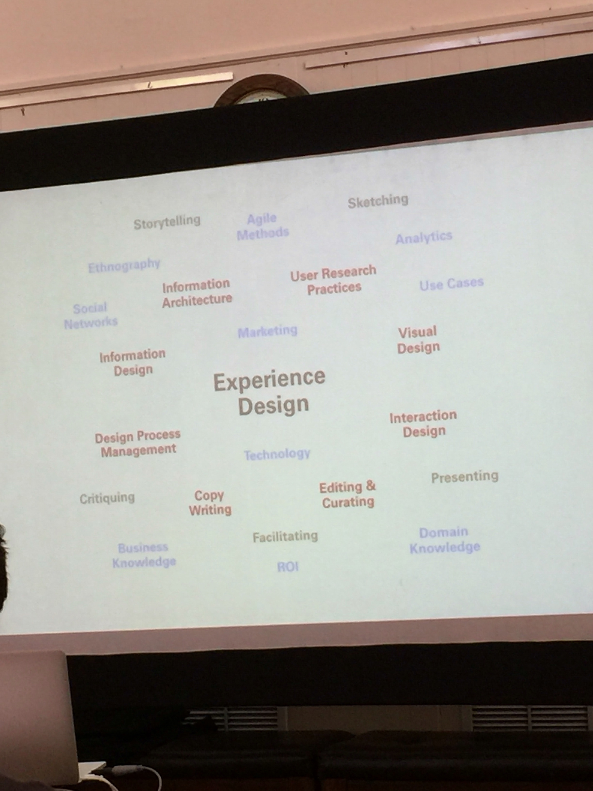

# [Creating a UX Strategy Playbook](https://playbook.uie.com/)
* June 20-21, 2016
* [Homework](https://playbook.uie.com/blog/homework-for-the-ux-strategy-playbook-workshop)
* [Slides](https://dl.dropboxusercontent.com/u/1086584/Playbook/Creating%20a%20UX%20Strategy%20Playbook%20-%20PHL.pdf)

## Morning, Day 1: Organizational Transformation
* [Knowledge Navigator](https://www.youtube.com/watch?v=QRH8eimU_20), Apple Video 1987
  * Shows apples vision, it describes siri, vid conference
* Vision
  * Vision is a stake in the sand, can direct the troops to walk towards the flag
  * When I have many choices, what gets me closer to the flag
  * Since the flag is in the sand, it can be moved
  * Each project can have its own flag, eventually those flags will converge
  * Keep visions to 5 years
* Every piece of the organization must be design infused
* Vision drives each of the Growth Stages of Organizational UX Design (From the HW)
* Need envisionment, videos, docs, etc for our products. What is it like to use the app in the future
* Journey map, frustration to delight, another form of envisionment
* Vision helps the Growth Stages of Understanding (From the HW). There is now something to compare to
* The UX leader's job is leveling up the team
  * UX leaders should constantly be educating
* Training is not brown bag lunches. Need to go inject learning while doing
  * We can pause the dev cycle to point out when we are using UX skills
* Explaining the problem and solution in one shot could be difficult
* The vision must be communicated over and over at every oppurtunity
* Alignment of vision requries shared vocabulary. Telling the vision as a story communicates vision and vocabulary.
* Identifying and building off common ground is important for a group story
* The playbook is strategic (higher level), not tatical (tatical is step by step how)
* The structure of the organization effect intentional design
* UX Frustration costs the bottom line
* Showing someone that UX is a hidden cost is a hidden champion for your cause
  * Your team can help them look good by achieving their goals
* Design thinking
  * End to end problem solving
  * Not just pretty
* Brainstorming to make the product as aweful as possible as a way to discovering a vision
  * No one ever squashes the idea for making it worse
  * Going negative back you into a vision by listing the opposites of the bad ideas

## Afternoon, Day 1: Product & Service Delivery Transformation
* Exposure, to users
  * Start with devs and PMs, move on to execs and other influencers
* Recommend 2 hours every 6 weeks, at a min
* User visit tracking, dashboard showing number of customer visits, days since last visit, % of team that have gone last 6 weeks
  * This gets user research into every sprint
* Roadmaps, rather than features, customer problems.
  * Sales can sell based on problems customers are having, rather than a feature checklist
  * Customer problems also gives wiggle room for implementation
* We should fall in love with our problems, not our solutions
* Measures - anything we can count
* Metrics - measures that we track
* Analytics - are measures that computers can track
* KPIs - Predict what is going to happen, example queue maniplulation at Netflix
  * Ratios are bad
  * Stay away from homogenious data
  * Bad instrumentation
  * [The 300m button article](https://articles.uie.com/three_hund_million_button/?utm_source=visitorcentric)
* Implement the frustration points
  * Start with error messages
* Netflix multivariant testing - it is not satisfactory to have a design that does well if they can not explain why that happens
* When talking metrics, go back to the executive business goals, this will tell if the optimization is worth it
* [Gallup CE11](http://www.gallup.com/businessjournal/745/constant-customer.aspx), for measuring engagment
  * Loyalty, confidence, integrity, pride, passion
  * Guttman scale
* Journey map book, Chris Risdon
  * from [UIE](https://www.uie.com/brainsparks/2012/12/21/chris-risdon-mapping-your-customers-journey/)
* When looking at plays, think, if you could do one thing this year, what would you do?
  * Getting started is the hardest part

## Morning, Day 2: Team Transformation
* [Gallup Q12](http://www.goalbusters.net/uploads/2/2/0/4/22040464/gallup_q12.pdf): Employee Engagement
  * #4 regular praise is something we forget to do, corrective action is more common
  * #6 encouraging employee development
* The most effective teams are teams that are engaged
* Surveys are anonomous and routinely run, 6 months, quarterly, looking for change
* Guttman scale
* Money is not on this scale, because it doesn't matter. If you get this list right, compensation will be fine.
* Management
  * Q12 is an assessment for how well you are managing
  * 2 elements of good manager, supporting folks and hiring good folks to support
  * How do we make management intentional?
  * [Manager-tools.com](https://www.manager-tools.com/)
    * Feedback
      * Affirmative feedback, this is connecting behavior and outcome
        * Poker chip method
      * Constructive feedback, same as affirmative, but asking the employee to change behavior
      * For the first 6 weeks, only give affirmative feedback
    * One on ones
      * 10m they talk about whatever they want
      * 10m you talk about what you need from them
      * 10m on coaching, moving them forward
      * This is the employees time, time to work on the Q12
      * Weekly one on ones is the most important on this list
    * Coaching
      * Finding a place where they need improvement and working on improving that
      * They do all the teaching themselves
* Leadership
  * Mangement  | Leadership
  * ---------- | ----------
  * role power | inspriration
  * .          | vision
  * .          | outcomes
  * .          | trust
  * Expectency bias
    * Smart rats example
    * Expect awesomeness from everyone
  * Facilated Leadership - eg grabbing the pen and writing designing on the whiteboard
    * Instead of talking about it, do an activity about it
    * Make sure everyone understand the outcome
    * Working towards the goal, lets move forward
    * Encouraging people to facilitate the meetings and play this role
* Need to create a culture of continuous learning, deliberately. Most of what we do for work, we do not learn in school
* Specialist vs Generalist vs Compartmentalist
  * having more expertise in one area over others vs having equal expertise in most areas vs having expertise in *only* one area
  * Compartmentalist is career limiting
* 
* One person, many skills
  * We label people and put them into roles, but this is wrong
  * Need to shift from roles to skills
* Generalist are more cost effective, but there are oppurtunities for specialist
* How to get people skilled up?
  * Research
    * Exposure
    * Domain knowledge
    * Design studio - Arron and Adams book
      * Create as many design as possible in short order, low fidelity
      * Show others the ideas and iterate drawing more designs
      * Discovery sprints - before the project, go out and find the context, make assumptions, see customers, test assumptions
        * Sprint & [Design Sprint](http://www.gv.com/sprint/)
  * Reflection
    * Considering the journey we have taken
    * One minute test
    * Daily reflections - fifth question on the standup, what did I learn and how will I use it going forward?
    * Jared's Daily Routine - 750 words, having a conversation with the page; not shared
    * Critique - Communicating design
      * Design review is moving the design forward
      * Critique is about craft; look at my craft and tell me how you would have done it differently; talk about the process and is this something others could use; this causes people to look back and reflect on their processes
      * Group deconstruction
        * PM to bring a screen and 2 competitor screens. List similarities and differences (based on UX skills, build vocabulary); not saying what is good or bad, initially, then good or bad and why?
  * Practice
    * Athletes, musicians are good at repeative practice
    * Start of design studio 10m practice drawing, lines, squares, etc, getting the feeling of the pen in the hand
    * Practice running usability sessions, with actor for the user
    * Pair people up, high skill with lower skill; high skill coaches up lower skill
* Hiring
  * Performance based hiring
    * Lou Adler [Hire with your head](https://www.amazon.com/Hire-Your-Head-Performance-Based-Hiring/dp/0470128356)
    1. Starts with a thank you note, 1 year after fictional hiring. This creates a list of objectives they will accomplish
    1. Objectives lead to performance profile; mindset is the candidate will eventually read this. All objectives are measurable and time based; create assement profile based on the performance profile;
    1. Write the job ad based on the obectives; describet the thing you need
    1. Evidence gathering; interviewers focus only on one objective; objectives get points and only hire based on certain point value
  * Designing a specific process, intentional
  * Week long test, and tell them to ask questions; Questions will tell you much more than the actual work produced

## More Links
* [Group Notes](https://docs.google.com/document/d/16J3e_x9MVMeugLhKRlvN0-i2h2cZdR91cEwdfZZ4Slo/edit#)
* [Full Playbook](https://dl.dropboxusercontent.com/u/1086584/Playbook/Plays%20-%20Complete%20Collection.pdf)
* [The Constant Customer](http://www.gallup.com/businessjournal/745/constant-customer.aspx)
* [CE11 Worksheet](https://dl.dropboxusercontent.com/u/1086584/Playbook/CE11%20Worksheet.pdf)
* [UIE Interns](https://www.uie.com/meet-the-interns/)
* [All you can learn](https://aycl.uie.com/)
* [Metrics Talk](https://www.uie.com/jared-live/#design-opposed)

## Books
* [First, Break All The Rules: What the World's Greatest Managers Do Differently](https://www.amazon.com/First-Break-All-Rules-Differently/dp/1595621113)
* [Hire with your head](https://www.amazon.com/Hire-Your-Head-Performance-Based-Hiring/dp/0470128356)
